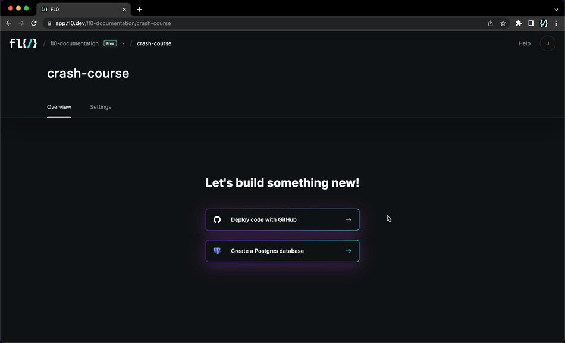

import MotivationalSong from '@site/src/components/MotivationalSong';

# Crash Course

Buckle up, it's time to learn the basics of deploying on FL0 **in less than 5 minutes**.

Here's what you'll need:

1. A [FL0 account](https://app.fl0.com)
2. A Github account with admin permissions
3. A <MotivationalSong>motivational song</MotivationalSong> to play while following these steps

## Complete the Onboarding

Head over to the [FL0 platform](https://app.fl0.com), create an account and complete the onboarding. The platform will guide you through:

1. Setting up your account
2. Creating a project

## Connecting a Repository

FL0 requires your code to live in a Git repository. When you first attempt to create an Application you'll be prompted to connect Github.
We currently support Github. If you use another provider, drop us a comment below.

## The Checklist

Regardless of the language you are deploying, there are a few things you need check before deploying on FL0.

  

    

      <h3>1. Check the supported scenarios</h3>
    

    

      

        Make sure what you're deploying will work by checking our list of <a href="/docs/supported-scenarios">supported scenarios</a>
      

    

  

  

    

      <h3>2. Listen to the right port</h3>
    

    

      

        FL0 routes traffic to your app using the <code>PORT</code> environment variable. Your app should listen to this port.
      

    

  

  

    

      <h3>3. Set your environment variables</h3>
    

    

      

        If your app needs certain environment variables to run, set them up before you deploy. Otherwise your app will crash on startup.
      

    

  

  

    

      <h3>4. Supply a Dockerfile (optional)</h3>
    

    

      

        FL0 recommends using a Dockerfile for most control. See our <a href="/docs/builds/dockerfile">Dockerfile quickstart</a> for more information.
      

      

        If you don't want to use a Dockerfile, make sure you've set up your codebase so FL0 knows how to build it. See our <a href="/docs/builds/buildpacks/">quickstart guides</a> for more information.
      

    

  

## Deploy!

Select one of your existing repos or use one of our templates and watch FL0 build and deploy it. Logs appear in realtime.

## Troubleshooting Failures

If your deployment fails, don't stress! FL0 provides detailed logs to help you determine the cause.

1. Check the Setup, build and deploy logs for any errors
2. If your app failed at the Deploy stage, check the Application Logs for any errors produced by your application on startup
3. If you're still stuck, ask FL0bot! FL0bot is our AI helper and can provide troubleshooting advice

Be sure to double-check the [checklist](#the-checklist) on this page. Read more on the [troubleshooting deployments](/docs/troubleshooting) page.

## Using Your Application

Once you have a successful deployment, you'll see a unique URL in the summary of your application. Use that to access your site or API.

## Wrapping Up

Nice work! You made it through the crash course on FL0. Be sure to check out our other tutorials to get started with your specific language!

- [Tutorial - Deploying a Database](./database)
- [Tutorial - Deploying a Node.js app](./express)
- [Buildpack Reference](/docs/builds//buildpacks)

<iframe src="https://giphy.com/embed/sw2jHJepEyfoEYUToh" width="384" height="480" frameBorder="0" class="giphy-embed" allowFullScreen></iframe>
<a href="https://giphy.com/gifs/MotorTrend-top-gear-topgear-america-sw2jHJepEyfoEYUToh">The FL0 crash course</a>

