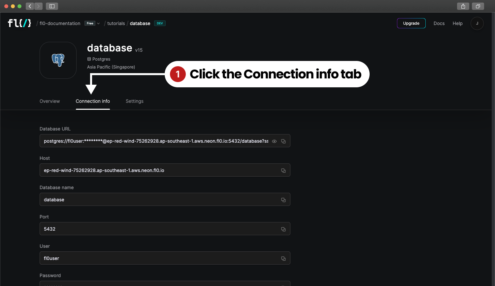
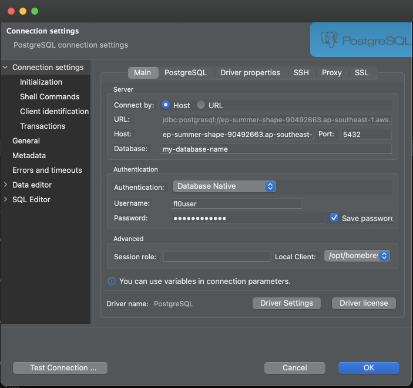

# Deploying a Postgres Database on FL0

In this tutorial, we're going to learn how to deploy a Postgres database on FL0 and connect to it from a client.

## Prerequisites

1. [DBeaver Database Client](https://dbeaver.io)

## Create a FL0 Account

Let's jump straight into FL0 to deploy our database.

Head over to the [FL0 platform](https://app.fl0.com), and create an account. You'll be guided through the creation of a Workspace and Project.
Once complete, you should see a screen with two buttons.

1. Deploy code with Github
2. Create a Postgres database

## Creating the Database

Click on the **Create a Postgres database** button. You'll be asked to choose a name and region for your database. Once done, click the **Create your database** button.

## Connecting to your Database

Once your database has finished provisioning, you'll see an overview screen with three tabs; Overview, Connection info and Settings.
Click on **Connection Info** to see the credentials required to access your database.

Using these credentials you can connect from any client, whether it runs on the command line or in a GUI.
There are no firewall restrictions on incoming connections, so you can connect from anywhere.

This tutorial uses DBeaver as an example, but you can use any client of your choice. DBeaver is a good choice - cross-platform and free!
To connect, just paste the individual `host`, `database`, `username` and `password` details from FL0 into the DBeaver connection window.

