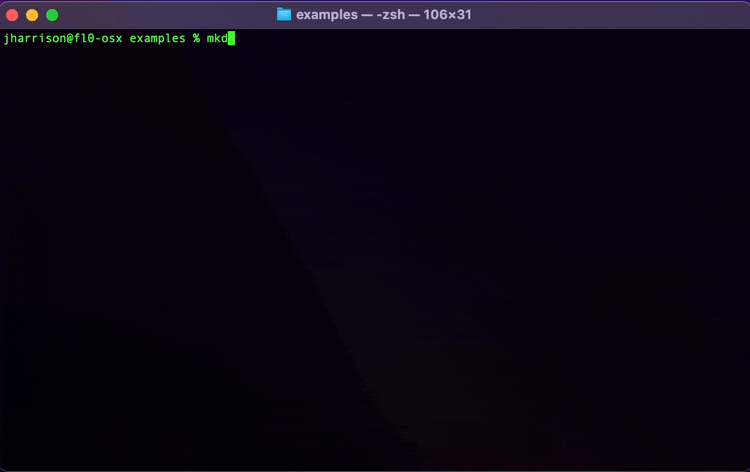
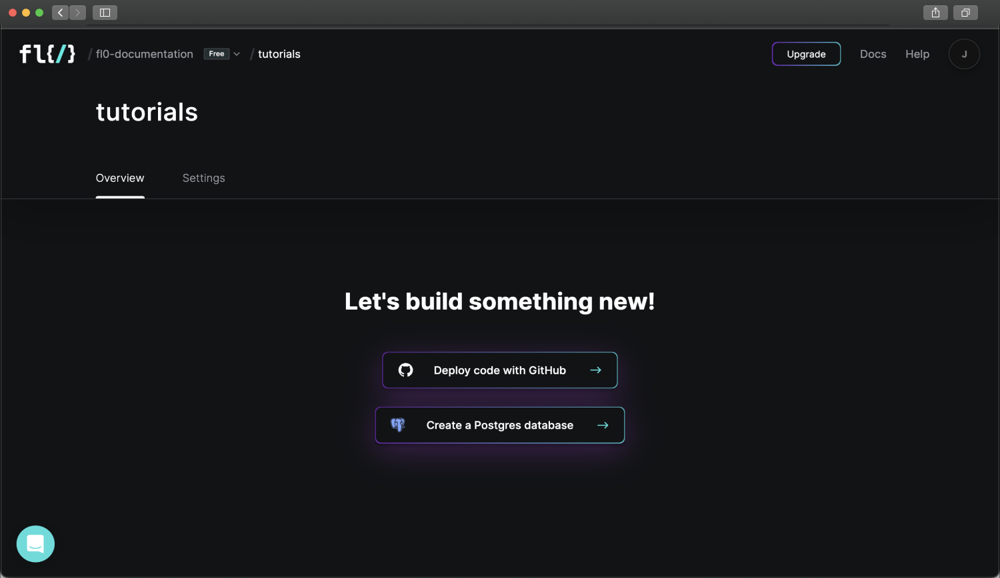
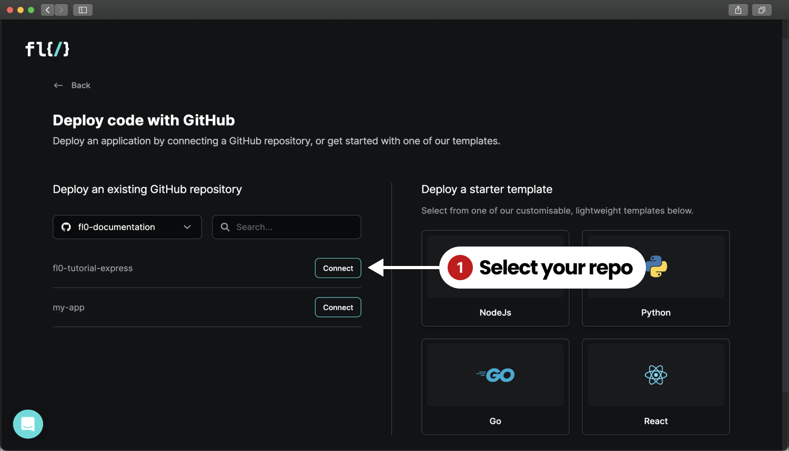
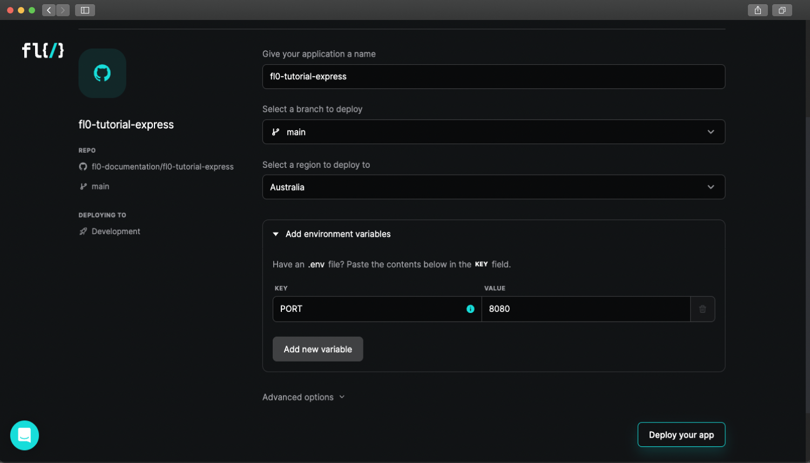
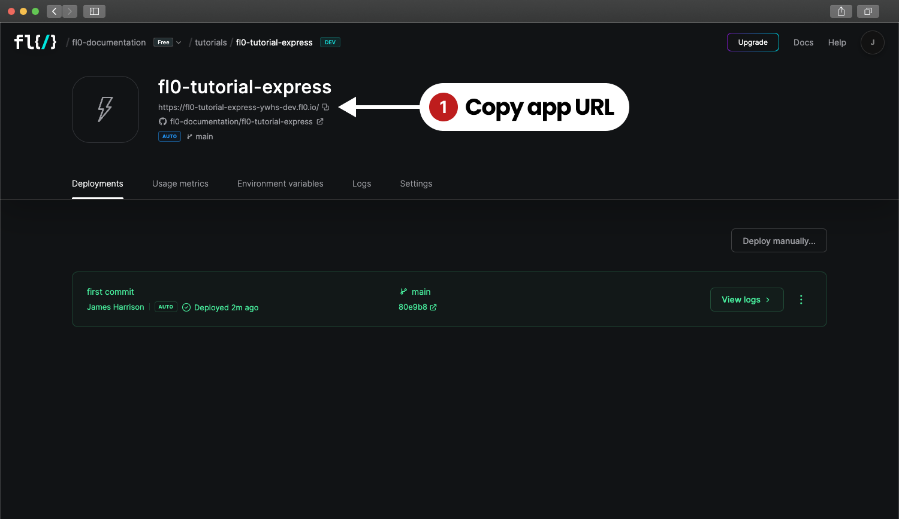
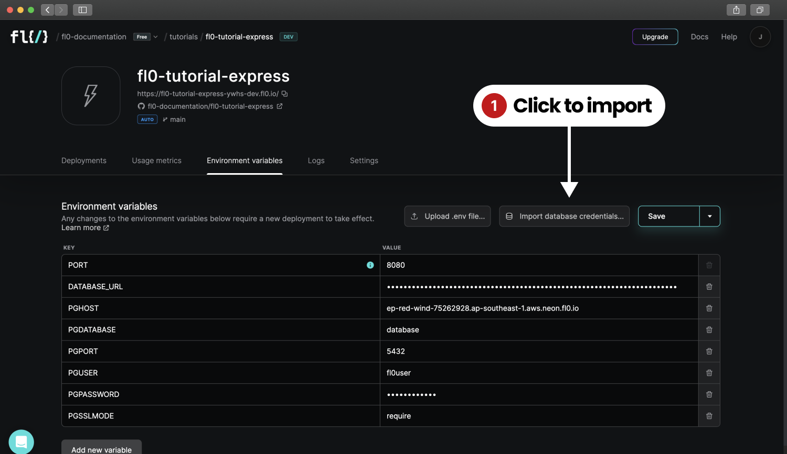

# Deploying an Express app on FL0

In this tutorial, we're going to learn how to deploy a Node.js app on FL0 using the Express web application framework.

## Prerequisites

1. A Github account with admin permissions (to install the FL0 connector)
2. An empty Git repo
3. Node.js >= v18.0
4. NPM >= v8.0

## Setting up an Express app for FL0

To get started, let's set up a fresh Express app. Open up your terminal and run the following commands

```bash
mkdir fl0-express-tutorial
cd fl0-express-tutorial
```

Now we have an empty folder we can initialize it as an NPM package and install Express:

```bash
npm init --yes
npm pkg set type="module"
npm install express
```



Create a new file in the root of your folder called `index.js` and add the following content. Take special note of how the `port` variable is set.
FL0 will pass in an environment variable to your app called `PORT`, and it expects your app to listen on that value.

```js title=index.js
import express from "express";
const app = express();
// Important! Set the port using the PORT environment variable
// highlight-next-line
const port = process.env.PORT ?? 3000;

app.get("/", (req, res) => {
  res.send("Hello World!");
});

app.listen(port, () => {
  console.log(`Example app listening on port ${port}`);
});
```

Test that your app is working by running this command from your terminal:

```bash
node index.js
```

After running the command you should see the message `Example app listening on port 3000`.
Open [http://localhost:3000](http://localhost:3000) in your browser to check that your application is working.
Commit your code to your repo to save your progress.

## Create a FL0 Account

Next up, let's jump into FL0 and get ready to deploy our application.

Head over to the [FL0 platform](https://app.fl0.com), and create an account. You'll be guided through the creation of a Workspace and Project.
Once complete, you should see a screen with two buttons.

1. Deploy code with Github
2. Create a Postgres database



## Connect Github

Click on **Deploy code with Github**. You'll need to give Github permissions to install the FL0 Github Connector.
Once connected, you'll see a list of your repositories displayed inside FL0.

:::caution
A Github org can only be connected to a single FL0 workspace at a time. If you experience any issues connecting Github, see the [Troubleshooting](/docs/guides/troubleshooting-github-connections) page.
:::



Click the **Connect** button next to the `fl0-tutorial-express` repository to continue.

## Configuring & Deploying

The next screen will ask you to configure your application. We can use the default settings for now.



Click **Deploy your app** to continue. Your app will automatically start building and deploying. The process should take about 2 minutes.
If everything goes well, you'll see a screen that looks like the one below. Copy the application's URL shown under the heading.



Paste the URL into your browser and you should see the familiar `Hello World!` message!

## Connecting to a Postgres Database

If you don't have a Postgres database yet, check out the [Postgres](/docs/getting-started/database) tutorial first!
To connect to the database, we need a database client. There are many clients and frameworks available, like Prisma, TypeORM, Sequelize and many more. For simplicity, we're going to use the basic [pg](https://www.npmjs.com/package/pg) NPM package. We can install it with this command:

```bash
npm install pg
```

We'll need some data to play with, so create a file called `db/schema.sql` and fill it with this SQL:

```sql title="db/schema.sql"
create table IF NOT EXISTS contacts (
	first_name VARCHAR(50),
	last_name VARCHAR(50),
	email VARCHAR(50),
	phone VARCHAR(50)
);
insert into contacts (first_name, last_name, email, phone) values ('Nessie', 'Aris', 'naris0@bandcamp.com', '298-108-5883');
insert into contacts (first_name, last_name, email, phone) values ('Sullivan', 'Shoorbrooke', 'sshoorbrooke1@pinterest.com', '144-695-5915');
insert into contacts (first_name, last_name, email, phone) values ('Elyn', 'Mangam', 'emangam2@google.ca', '494-744-4973');
insert into contacts (first_name, last_name, email, phone) values ('Peder', 'Gathercole', 'pgathercole3@odnoklassniki.ru', '523-386-9896');
insert into contacts (first_name, last_name, email, phone) values ('Parker', 'Hails', 'phails4@shop-pro.jp', '955-771-1380');
insert into contacts (first_name, last_name, email, phone) values ('Nichole', 'Aulds', 'naulds5@jalbum.net', '381-753-1987');
insert into contacts (first_name, last_name, email, phone) values ('Flem', 'Robbeke', 'frobbeke6@twitpic.com', '158-260-4378');
insert into contacts (first_name, last_name, email, phone) values ('Shelbi', 'Guillou', 'sguillou7@microsoft.com', '480-149-9081');
insert into contacts (first_name, last_name, email, phone) values ('Gladys', 'Endrighi', 'gendrighi8@indiegogo.com', '584-935-9687');
insert into contacts (first_name, last_name, email, phone) values ('Donelle', 'Dunphie', 'ddunphie9@gnu.org', '312-865-0049');

```

Next, let's add a new file to our codebase: `db/index.js`. Add the following code, being sure to replace `<YOUR DB URL HERE>` with the URL from FL0's database.

```js title="db/index.js"
import pg from "pg";
import fs from "fs";

const pool = new pg.Pool({
  connectionString: "<YOUR DB URL HERE>",
});

export const bootstrap = async () => {
  const res = await query("SELECT * from contacts");
  if (!res.rowCount) {
    console.log("Bootstrapping database");
    const schema = fs.readFileSync("db/schema.sql");
    await query(schema.toString("utf-8"));
  }
};

export const query = (text, params, callback) => {
  return pool.query(text, params, callback);
};
```

Update your `index.js` file to look like this:

```js title="index.js"
import express from "express";
// highlight-next-line
import * as db from "./db/index.js";

const app = express();
// Important! Set the port using the PORT environment variable
const port = process.env.PORT ?? 3000;

app.get("/", (req, res) => {
  res.send("Hello World!");
});

// highlight-start
app.get("/contacts", async (req, res) => {
  const result = await db.query("SELECT * FROM contacts");
  res.send(result.rows);
});

await db.bootstrap();
// highlight-end

app.listen(port, () => {
  console.log(`Example app listening on port ${port}`);
});
```

Now we have a new route, `/contacts`, which will return all the contacts found in our database. We also added a line to run the `db.bootstrap()` function when the app boots, to populate the database if it's empty.

Your folder structure should look like this:

```
fl0-express-tutorial
├── db
│   ├── index.js
│   └── schema.sql
├── index.js
├── node_modules
├── package-lock.json
└── package.json
```

Run `node index.js` again and open [http://localhost:3000/contacts](http://localhost:3000/contacts) in the browser. You should see your list of contacts returned as JSON! Commit your changes and push them to your Git repo to see FL0 automatically build and deploy a new version.

## Using Environment Variables

What we've achieved so far is great...but we hard-coded the database URL into our code, which isn't good practice. Instead, we can use Environment Variables to store secret information like credentials. Let's get it working locally first.

Create a new file in the root of your repo called `.env`. Paste in the following content, replacing `<YOUR DB URL HERE>` with your database URL from FL0.

```bash title=".env"
DATABASE_URL=<YOUR DB URL HERE>
```

We don't want this file added to Git, so add a line to your `.gitignore` file as well:

```bash title=".gitignore"
node_modules
.env
```

In order to read this file and load the values into our Node process, we need to use a library called [dotenv](https://www.npmjs.com/package/dotenv).

```bash
$ npm install --save-dev dotenv
```

We only want to use `dotenv` for local development, so we'll create a new `script` in `package.json` to start a development server using `dotenv`.

```json title="package.json"
{
  "name": "fl0-express-tutorial",
  "version": "1.0.0",
  "description": "",
  "main": "index.js",
  "scripts": {
    // highlight-next-line
    "start:dev": "node -r dotenv/config index.js",
    "test": "echo \"Error: no test specified\" && exit 1"
  },
  ...
}
```

:::info
When running on FL0, environment variables will be automatically injected without the need for the `dotenv` library.
:::

Finally, update `db/index.js` to use the environment variable instead of the hard-coded value:

```js title="db/index.js"
import pg from 'pg';
import fs from 'fs';

const pool = new pg.Pool({
    connectionString: process.env.DATABASE_URL
});

...
```

Now, you can run your app locally with this command: `npm run start:dev`.
To run on FL0, the Environment Variables need to be set through the UI.

1. Navigate to your Application in FL0
2. Click on the Environment Variables tab
3. Click the **Import database credentials** button and select your database
4. Click the **Save** button

FL0 automatically adds the database credentials to your app. Commit your code and push it to your repo to run another build.


