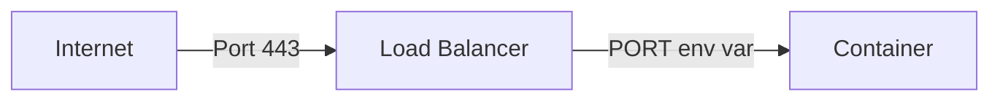

---
---

# How to Listen to the Right Port

FL0 injects an environment variable called PORT into your application's container. Your app must listen on this port. You can override this by providing a different value for `PORT` in the [Environment Variables](../platform/applications#environment-variables) section of your application.



Below are some examples of how to do this with popular languages and frameworks.

## Node.js

### Express

```js title="/app.js"
const express = require("express");
const app = express();

// This line is important to ensure your app listens to the PORT env var
const port = process.env.PORT ?? 8080;

app.listen(port, () => {
  console.log(`App listening on port ${port}`);
});
```

### Nest

```ts title="/src/main.ts"
import { NestFactory } from "@nestjs/core";
import { AppModule } from "./app.module";

async function bootstrap() {
  const app = await NestFactory.create(AppModule);

  // This line is important to ensure your app listens to the PORT env var
  await app.listen(process.env.PORT, "0.0.0.0");
  console.log(`Application is running on: ${await app.getUrl()}`);
}
bootstrap();
```

## Go

```go
package main

import (
	"fmt"
	"net/http"
	"os"
	"time"
)

func greet(w http.ResponseWriter, r *http.Request) {
	fmt.Fprintf(w, "Hello World!  %s", time.Now())
}

func main() {
	http.HandleFunc("/", greet)
	port := os.Getenv("PORT")
	if port == "" {
		port = "8080"
	}
	http.ListenAndServe(":"+port, nil)
}
```

## .NET - C#

```csharp
public static IHostBuilder CreateHostBuilder(string[] args) =>
    Host.CreateDefaultBuilder(args)
        .ConfigureWebHostDefaults(webBuilder =>
        {
            webBuilder.UseStartup<Startup>();
            var port = Environment.GetEnvironmentVariable("PORT") ?? "8080";
            webBuilder.UseUrls($"http://*:{port}/");
        });
```

## Java - Spring Boot

```java
    SpringApplication app = new SpringApplication(DemoApplication.class);
    String port = System.getenv("PORT");
    app.setDefaultProperties(Collections.singletonMap("server.port", port == null ? "8080" : port));
    app.run(args);
```

## Rust - axum

```rust title=src/main.rs
// read the port from env vars.
let port = std::env::var("PORT")
  .unwrap_or("8080".to_string())
  .parse::<u16>()
  .expect("could not parse PORT env var");

// setup the axum routes.
let app = Router::new()
  .route(...

// bind the server to localhost and the port read from env vars above.
axum::Server::bind(&SocketAddr::from(([0, 0, 0, 0], port)))
  .serve(app.into_make_service())
  .await?;
```

## What Happens If I Don't?

If your application listens to a different port, like `3000`, FL0's load balancer won't be able to route traffic to your containers. Your app will start, but you'll see an error like the one below when testing your endpoints:

```
upstream connect error or disconnect/reset before headers. reset reason: connection failure
```
