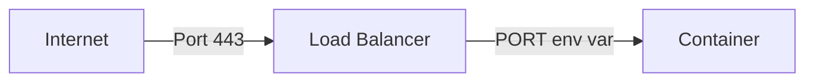

---
---

# How to Listen to the Right Port

FL0 injects an environment variable called PORT into your application's container. Your app must listen on this port. You can override this by providing a different value for `PORT` in the [Environment Variables](../platform/environment-variables) section of your application.



## How Do I Do This?

The way to do this will be different depending on your programming language. In NodeJS, for example, you would listen to the `process.env.PORT` variable:

```js title="/app.js"
const express = require("express");
const app = express();

// This line is important to ensure your app listens to the PORT env var
const port = process.env.PORT ?? 8080;

app.listen(port, () => {
  console.log(`App listening on port ${port}`);
});
```

For other language-specific examples, see our [Quickstart Guides](../quickstarts/).

## What Happens If I Don't?

If your application listens to a different port, like `3000`, FL0's load balancer won't be able to route traffic to your containers. Your app will start, but you'll see an error like the one below when testing your endpoints:

```
upstream connect error or disconnect/reset before headers. reset reason: connection failure
```
