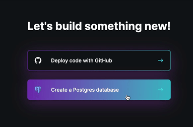
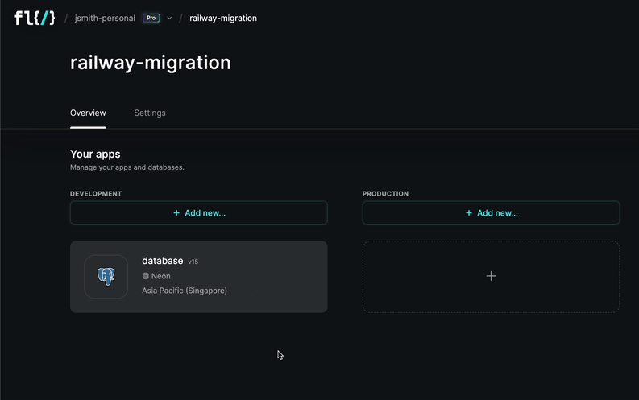
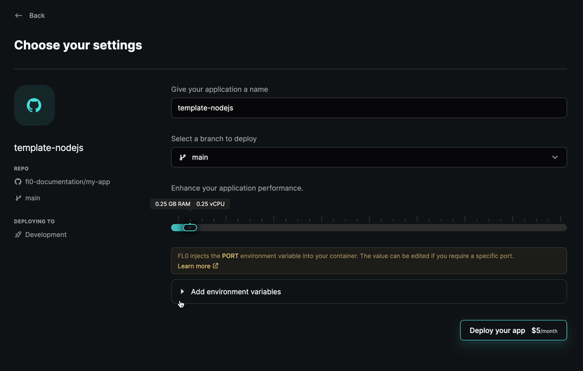
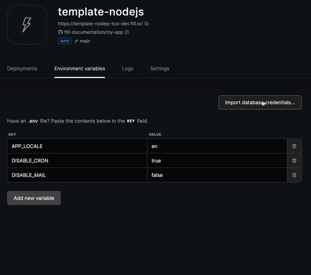

---
---

# Migrating from Railway

With Railway sunsetting their free tier, now is a great time to make use of FL0's free plan. It's perfect if you're deploying web services - frontend or backend.

<iframe width="560" height="315" src="https://www.youtube.com/embed/9BiJjrPzPi0" title="YouTube video player" frameborder="0" allow="accelerometer; autoplay; clipboard-write; encrypted-media; gyroscope; picture-in-picture; web-share" allowfullscreen></iframe>

## Setting up a FL0 Account

Head over to the [FL0 platform](https://app.fl0.com), create an account and complete the onboarding. The platform will guide you through setting up your account and creating a project.


### Create Your Databases

If you were using Postgres databases in Railway, now's the time to recreate them in FL0! You can do this by clicking the `Add New` dropdown and selecting `Postgres Database`. Give a name to your database, and click the Create button. And voila! We have a new database.



## Migrating Data

Let's look at how you can backup your Railway database and import it into FL0.

:::info tip
If you have active users, you might want to put up a Maintenance page so data isn't modified while you're migrating.
:::

### Backing Up Railway Data

Backup your Railway Postgres data by [following their instructions](https://blog.railway.app/p/postgre-backup).

### Importing Data Into FL0

Open your database on FL0 and navigate to the Connection Info screen. There, you'll find the credentials you need to connect and import data.



To import, you can use any of your preferred tools. For a nice UI, check out [DBeaver](https://dbeaver.io/)

## Migrating Apps

Now that we have a database, we can create a new application. This can be done by clicking the `Add New` dropdown and selecting `Application`. You will be prompted to link your Github account if you haven't done that yet.

### Environment Variables

While deploying your application, FL0 will allow you to set environment variables for your app. To extract these from Railway, use this CLI command:

```bash
railway variables -k >> .env
```

This command will extract the environment variables from Railway and save them to a file called `.env`.
Copy the contents of the `.env` file and paste it into the first row of the Environment Variables page in FL0.



### Connecting to the Database

FL0 can automatically import database credentials into your Environment Variables for you!
Just open your Application on FL0, navigate to the Environment Variables page and click the "Import database credentials" button.



## Feature & Terminology Comparison

Below is a list of Railway features and how they compare in FL0.

- **Projects:** FL0 also has Projects, however they are grouped into a **Workspace**, which is where billing and team members are managed. Workspaces are like organizations or teams.
- **Services:** In FL0, these are called Applications and are always connected to a Github repository.
- **Variables:** FL0 calls these Environment Variables. If you use Dynamic Variables in Railway, you'll need to flatten them to normal values when migrating to Fl0.
- **Environments:** FL0 supports a single environment on Free plans and 2 environments on Pro plans (Dev and Prod).
- **Volumes:** FL0 does not support storage volumes yet, but you can use third party services like AWS S3.
- **Databases:** Support for Postgres is built-in, and you can connect external databases to your service if you use other types such as Mongo or MySQL.
- **Private networking:** In FL0, all your applications are exposed on public URLs but you can communicate from one application from another using its hostname (the name of the application).

## Supported languages

The following table is a list of languages and their support across Railway and FL0. Both platforms provide built-in language support (without the need for a Dockerfile) for common languages. Railway uses [Nixpacks](https://nixpacks.com/) and FL0 uses [Paketo](https://paketo.io).

You can always use a Dockerfile if your language is not covered under a build pack.

| Language | Railway                                                | FL0                                                      |
| -------- | ------------------------------------------------------ | -------------------------------------------------------- |
| Go       | <span class="badge badge--success">Yes</span>          | <span class="badge badge--success">Yes</span>            |
| Java     | <span class="badge badge--success">Yes</span>          | <span class="badge badge--success">Yes</span>            |
| NodeJS   | <span class="badge badge--success">Yes</span>          | <span class="badge badge--success">Yes</span>            |
| PHP      | <span class="badge badge--success">Yes</span>          | <span class="badge badge--success">Yes</span>            |
| Python   | <span class="badge badge--success">Yes</span>          | <span class="badge badge--success">Yes</span>            |
| Ruby     | <span class="badge badge--success">Yes</span>          | <span class="badge badge--success">Yes</span>            |
| .NET     | <span class="badge badge--success">Yes</span>          | <span class="badge badge--success">Yes</span>            |
| Nginx    | <span class="badge badge--success">Yes</span>          | <span class="badge badge--success">Yes</span>            |
| Rust     | <span class="badge badge--success">Yes</span>          | <span class="badge badge--warning">Via Dockerfile</span> |
| Crystal  | <span class="badge badge--success">Yes</span>          | <span class="badge badge--warning">Via Dockerfile</span> |
| Deno     | <span class="badge badge--success">Yes</span>          | <span class="badge badge--warning">Via Dockerfile</span> |
| Haskell  | <span class="badge badge--success">Yes</span>          | <span class="badge badge--warning">Via Dockerfile</span> |
| Swift    | <span class="badge badge--success">Yes</span>          | <span class="badge badge--warning">Via Dockerfile</span> |
| Zig      | <span class="badge badge--success">Yes</span>          | <span class="badge badge--warning">Via Dockerfile</span> |
| Dart     | <span class="badge badge--success">Yes</span>          | <span class="badge badge--warning">Via Dockerfile</span> |
| Elixir   | <span class="badge badge--success">Yes</span>          | <span class="badge badge--warning">Via Dockerfile</span> |
| Bun      | <span class="badge badge--warning">Experimental</span> | <span class="badge badge--warning">Via Dockerfile</span> |
