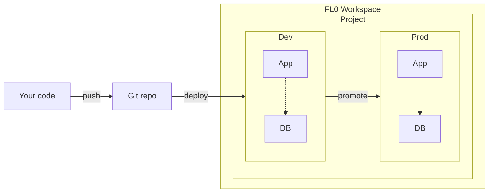

# Introduction

## What is FL0?

FL0 is a platform that makes it really simple to deploy your code as a web service.
FL0 can build your code into a container using one of two methods:

1. Building a Dockerfile that you provide in your repo
2. By automatically detecting your codebase

Once built, we deploy it to your Dev environment on FL0 and provide you with a unique URL.
Next time you push a change to your repo, we repeat the process automatically or manually depending on your chosen settings.

