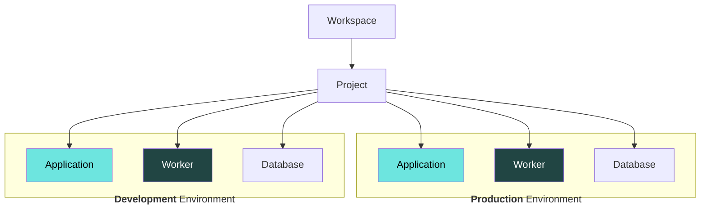

```mermaid
flowchart
    workspace1[Workspace]
    project1[Project]
    workspace1 --> project1
    project1 --> app1
    project1 --> worker1
    project1 --> db1
    project1 --> app2
    project1 --> worker2
    project1 --> db2
    subgraph prod [<br/><br/><br/><br/><b>Production</b> Environment<br/>]
        class prod cssClass
        app2[Application]
        worker2[Worker]
        db2[Database]
    end
    subgraph dev [<br/><br/><br/><br/><b>Development</b> Environment]
        app1[Application]
        worker1[Worker]
        db1[Database]
    end
    classDef highlight-app fill:#6de5df,color:#000;
    classDef highlight-worker fill:#214543,color:#fff;
    class app1,app2 highlight-app;
    class worker1,worker2 highlight-worker;
    click workspace1 "/docs/platform/workspaces"
    click project1 "/docs/platform/projects"
    click app1,app2 "/docs/platform/applications"
    click worker1,worker2 "/docs/platform/applications"
    click db1,db2 "/docs/platform/databases"
```