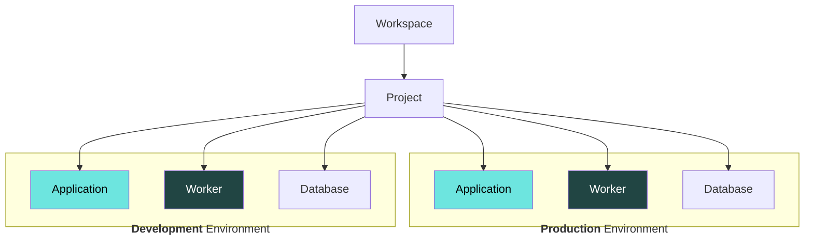
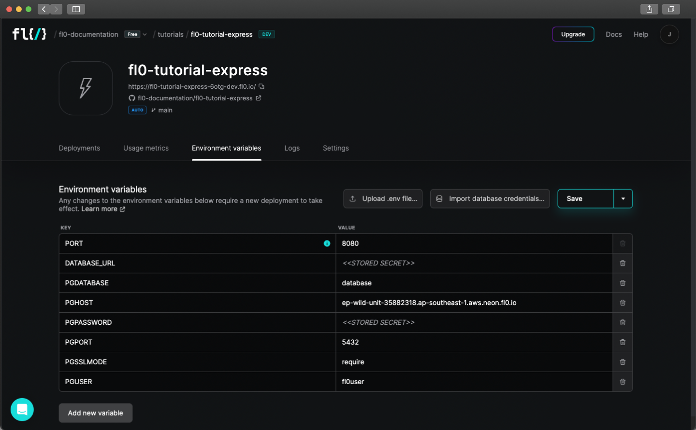
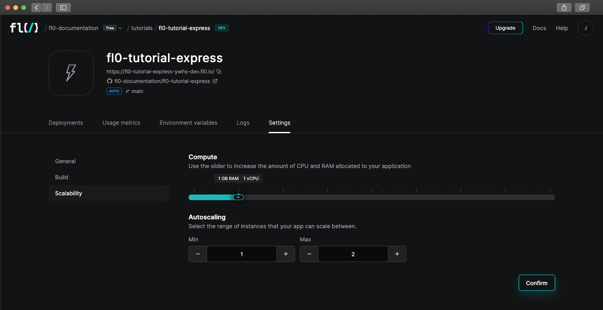

# Applications & Workers

With FL0 you can take your code and turn it into a working application, deployed as containers in our fully managed infrastructure.

**Applications** can provide REST or GraphQL APIs, run scheduled jobs, perform batch processing or any other kind of backend processes.

**Workers** are background applications that perform background tasks (for example, chatbots or message queues) and do not need to listen to any incoming ports.



## Creating Applications

### Requirements

In order to create an app in FL0, you must have the following:

1. Your code stored in a Github repository
2. Admin permissions to the Github organization

### Connecting to Github

See the section on [Connecting a Workspace to Github](/docs/platform/workspaces.md#connecting-a-workspace-to-github).

### Naming the App

The name you give your app will become part of the hostname of the app. See the section on [Using the App](#using-the-app) for more information.

### Automatic vs Manual Deployments

By default, FL0 is configured to automatically deploy the latest version your app whenever a commit is pushed to your chosen branch. You can also choose to manually deploy your code based on a nominated branch or commit hash.

### Environment Variables

Environment variables are custom settings that can be passed into your app when FL0 deploys it. These settings can have different values in Development and Production.

Common scenarios where you might need to use Environment Variables include:

1. Storing database credentials
2. Storing other sensitive information that you don't want stored in Git
3. Configuring environment-specific settings, like log levels or debug modes



To set Environment Variables:

1. Navigate to your application and click on the **Environment Variables** tab. Make sure you're in the correct Environment (dev or prod)
2. Add a new row to the table by clicking the **Add new variable** button
3. Give the variable a name. Names can only include alpha-numeric characters or underscores
4. Set a value for the variable. Optionally mark it as secret, so it can't be read by others
5. Click the **Save** or **Save and deploy** button. Changes to Environment Variables will not take effect until the next deployment

:::caution
Secret environment variables can still be read by your application. Developers must be careful to not write secret environment variables to logs or output them in any way.
:::

## Using Applications

### Application URL

Every application is given a unique URL. Once successfully deployed, you can access your app using the URL found on the **App Overview** page.

:::info note
Workers do not not listen to any network ports and will not be assigned a URL.
:::

For **Development** applications, the URL pattern is:

```
https://{app-name}-dev-{unique-identifier}.{region}.fl0.io
```

1. `{{app-name}}` is the name you chose when creating the app
2. `dev` indicates `Development` environment
3. `{{unique-identifier}}` is a randomly generated 4 character string
4. `{{region}}` indicates the regional location of the app -- a numeric prefix followed by a [location identifier](/docs/platform/networking) (eg: `4.us-1`)

For **Production** applications, the URL pattern is:

```
https://{app-name}-{unique-identifier}.{region}.fl0.io
```

1. `{{app-name}}` is the name you chose when creating the app
2. `{{unique-identifier}}` is a randomly generated 4 character string
3. `{{region}}` indicates the regional location of the app -- a numeric prefix followed by a [location identifier](/docs/platform/networking) (eg: `4.us-1`)

:::tip
To set up a custom domain, see the [Networking section](./networking)
:::

### Viewing Logs

Logs from the containers running your apps can be found on the **Logs** tab.

1. If multiple containers are running, you can select the instance (container) to view from the dropdown
2. You can download logs from a specific date range by clicking the **Download logs** button

### Scaling Applications

Application CPU and RAM can be scaled up and down depending on your requirements.
Navigate to **Settings > Scalability** inside your application adjust the defaults.

- **Compute:** The amount of CPU and RAM to give each instance of your application.
- **Autoscaling:** FL0 can automatically scale your app horizontally when the CPU reaches an average of 70%. You can set limits on the min and max number of instances



## Pausing Applications

You can pause an Application or Worker to avoid consuming resources and incurring costs.

:::info note
Pausing does not affect any databases connected to your app.
:::

While paused, an Application or Worker will not not:
 - use any CPU or RAM resources
 - respond to any requests
 - run any background processes
 - support manual or automatic deployment

You can unpause at any time to resume activity using the most recent app deployment.

To view or change your app's pause status, navigate to **Settings > General**.

### Auto-Pausing in Free Workspaces

Free workspaces on FL0 are intended to be used for development and evaluation purposes.

Applications and Worker services running in free workspaces will be automatically paused (with email notification) if they have not been viewed via the FL0 platform within 24 hours. Auto-paused services can be manually restarted.

:::tip
Services running in Pro or other paid tiers will not be automatically paused, but can still be manually paused to save on resource costs.
:::
