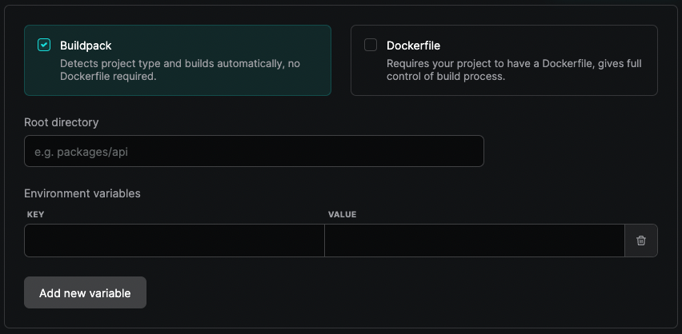
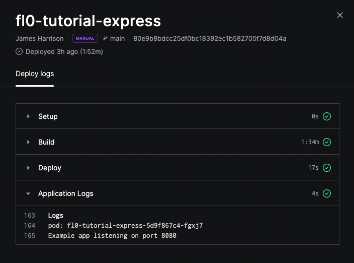

# Builds & Deployments

In FL0, a build is the process of taking your code and turning it into a container image. A deployment is the act of moving that container into your cluster.
To find your application's build settings, open your application in FL0 and navigate to **Settings > Build**.

## Configuring Build Settings

You can adjust how FL0 builds your application. There are two methods you can use:

1. Buildpacks: FL0 will automatically build a container based on the detected language
2. Dockerfile: Provide a Dockerfile in your repo and FL0 will use it to build the container

### Buildpack

FL0 buildpacks currently support the following languages:

- Java
- Node.js
- .NET Core
- Go
- Web Servers/Static Sites (HTTPD and Nginx)
- Python
- PHP
- Ruby

For other languages, please build using a [Dockerfile](#dockerfile).



The following settings are available for Buildpack builds:

**Root directory**  
The path FL0 will look in to find your code, relative to your Git repository's root directory. If you have a monorepo, you will need to use this setting to tell FL0 which app to build.

Given the following folder structure:

```
my-git-repo
├── apps
│   ├── frontend
│   └── backend
├── README.md
└── LICENSE
```

Set the **Root directory** to either `apps/frontend` or `apps/backend` to change which app to build.

**Environment variables**  
You can pass environment variables (also called 'build arguments') into the build process to alter how the buildpack behaves. The available build arguments are different depending on the language you are using. See the [Buildpack documentation](/docs/builds/buildpacks) for your language for more details.

For example, in a Node.js project you can override the installed node version by setting a build argument called `BP_NODE_VERSION`.

### Dockerfile

If your project requires more advanced scenarios or you already have a Dockerfile, use this build type. With a Dockerfile, you can extend support to other languages like Rust or even deploy applications like [Appsmith](https://appsmith.com) or [PGAdmin](https://www.pgadmin.org/).


The following settings are available for Dockerfile builds:

**Dockerfile location**  
The path to your Dockerfile, relative to the repository root.

**Target**
If you use a [multi-stage](https://docs.docker.com/build/building/multi-stage/) Dockerfile, you can use this setting to configure which stage FL0 will build.

**Docker context**
The directory in which to perform the build. Relative to the root path of your repository.

**Docker args**
Arguments to pass into the Docker build process. For more information, see Docker's documentation on [build arguments](https://docs.docker.com/build/guide/build-args/).

## Build Stages

Once a build is kicked off, it will go through three distinct stages as described below.



### Setup

In this stage, FL0 prepares your codebase for build. If you see any problems with the Setup stage, please contact FL0 support.

### Build

This is the main build stage. It performs different tasks depending on whether you are using Buildpacks or Docker. At a high level, the Build stage does the following:

1. Clones your repository from Git
2. If using a Buildpack, FL0 will auto-detect which buildpack to use based on what your repository looks like
3. If using Docker, FL0 will run `docker build` using the settings configured for your app
4. Builds your codebase into a container image
5. Pushes your container image into FL0's built-in registry

The Build stage may fail for multiple reasons, including:

1. FL0 was unable to detect the right buildpack to use
2. There was an error in your Dockerfile
3. Your codebase was unable to be built with a Buildpack due to various reasons. For example, using an unsupported language version

### Deploy

The final stage is responsible for deploying your container's image to your FL0 cluster.

1. Pulls your image from the registry and creates new instances
2. Boots your application
3. Runs health-checks to determine if your application started successfully

The Deploy stage may fail if your application crashes on startup or if FL0 is not able to connect to it over the specified port. To troubleshoot a failed deployment, navigate to the **Logs** tab of your application to see if any errors were generated. Double-check the port you are listening to and check our [troubleshooting guide](/docs/troubleshooting) for more details.
