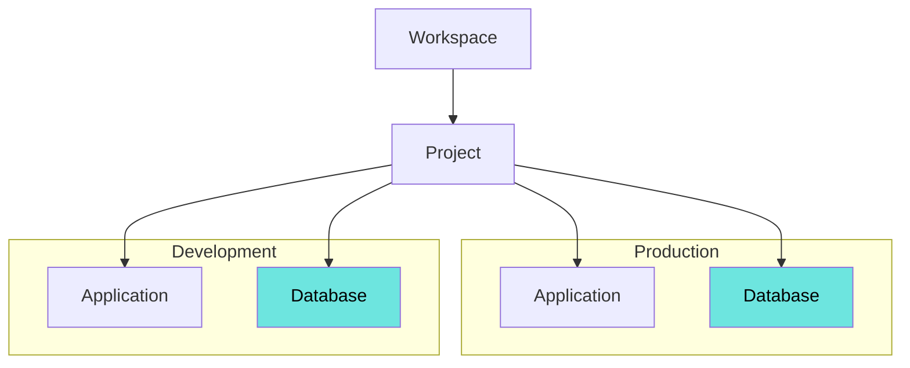

# Databases

```mermaid
flowchart
    workspace1[Workspace]
    project1[Project]
    workspace1 --> project1
    project1 --> app1
    project1 --> db1
    project1 --> app2
    project1 --> db2
    subgraph prod [Production]
        class prod cssClass
        app2[Application]
        db2[Database]
    end
    subgraph dev [Development]
        app1[Application]
        db1[Database]
    end
    classDef highlight fill:#6de5df,color:#000;
    class db1,db2 highlight;
```

## Creating Databases

## Connecting to Databases
