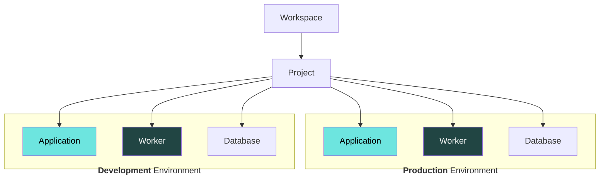

# Databases



## Creating Databases

Setting up a database in FL0 can be done in a couple of clicks! The steps on this page will show you how to add a Postgres database to your FL0 Project and connect it to an App.

1. From your Project's Overview page, click the **Add new** button and select **Postgres database** from the options shown
2. Give the database a name
3. Choose a region - your data will live here
4. Configure the scaling settings

## Connecting to the Database

1. Navigate to the Environment Variables tab of your FL0 Application
2. FL0 will automatically detect the database and show a banner allowing you to import database credentials. Click the "Import database credentials" button
3. In your code, access the credentials using `process.env.DATABASE_URL`

How you use the `DATABASE_URL` environment variable will differ depending on your chosen database client.

### Node.js

#### Sequelize

Sequelize has a number of ways to specify connection details. Below are a couple of examples.

Firstly, [directly specifying](https://sequelize.org/docs/v6/getting-started/#connecting-to-a-database) connection details:

```javascript
const sequelize = new Sequelize(process.env.DATABASE_URL);
```

Or via the use of a [config file](https://sequelize.org/docs/v6/other-topics/migrations/#configuration):

```json title="src/config/config.json"
{
  "local": {
    "use_env_variable": "DATABASE_URL",
    "logging": false
  },
  "development": {
    "use_env_variable": "DATABASE_URL",
    "logging": false
  },
  "production": {
    "use_env_variable": "DATABASE_URL",
    "logging": false
  }
}
```

```javascript title="src/models/index.js"
...
const env = process.env.NODE_ENV || 'development';

const config = require(__dirname + '/../config/config.json')[env];
const db = {};

let sequelize;
if (config.use_env_variable) {
  sequelize = new Sequelize(process.env[config.use_env_variable], config);
} else {
  sequelize = new Sequelize(config.database, config.username, config.password, config);
}
...
```

#### Prisma

Configure your `schema.prisma` file as follows:

```javascript title="prisma/schema.prisma"
datasource db {
  provider = "postgresql"
  url      = env("DATABASE_URL")
}
```

See Prisma's [documentation](https://www.prisma.io/docs/reference/database-reference/connection-urls) for more information.

## Connecting from an External Client

FL0 databases can be accessed from a client like [PGAdmin](https://www.pgadmin.org/) from your own machine. The connection details can be found in FL0 on the **Connection Info** tab of the database.
