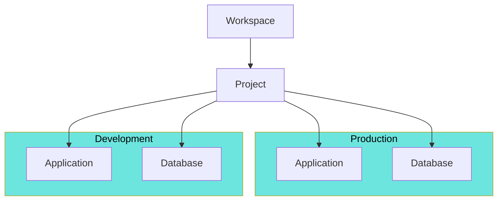
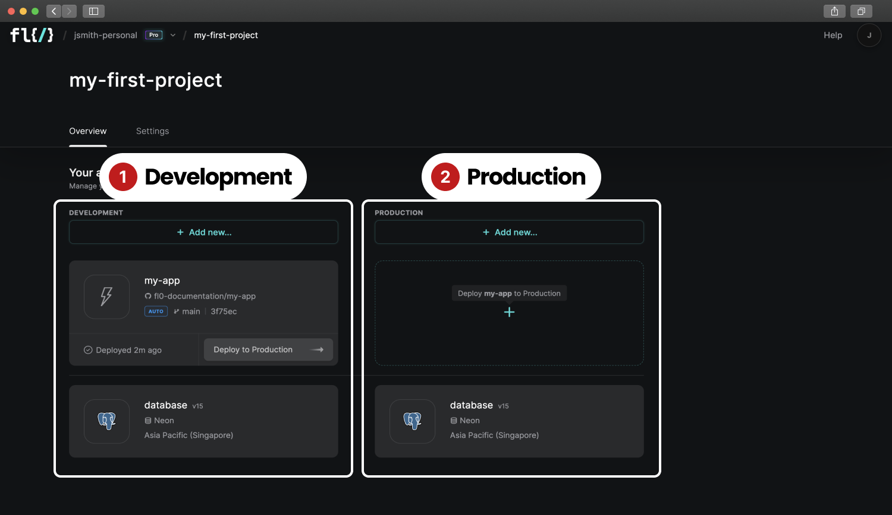

# Environments

Environments are a way of separating your development/test data from your production data. Every FL0 project comes with 2 environments; Development and Production.

1. Network segregation
2. App deployments
3. Databases

## Viewing Environments

You can see your environments by visiting the Project Overview page. Environments are shown as columns containing your applications and databases.

## Working with Environments

In the screenshot above, Development contains 2 resources; `my-app` and `database` - whereas Production only contains `database`.
If `my-app` were to be deployed to Production, it would have different environment variables, settings and public URL to its counterpart in Development.

The `database` resource exists in both environments, but the data and settings are entirely separate. Changes to one will not affect the other. It's also possible to have resources deployed to just Production but not Development.

## Deploying Between Environments

Visit the [Deployments](./deployments) page to read more about moving resources between environments.

## Networking

To read more about environments and networking, visit the [Networking](./networking) page.
