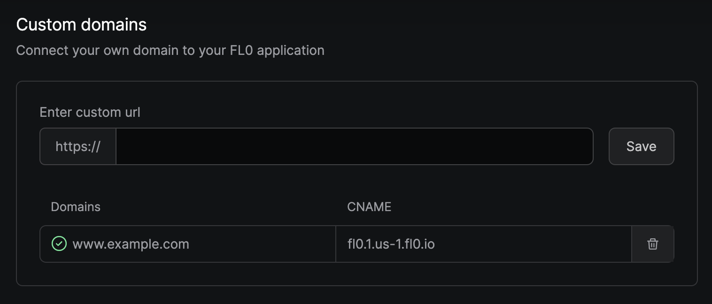
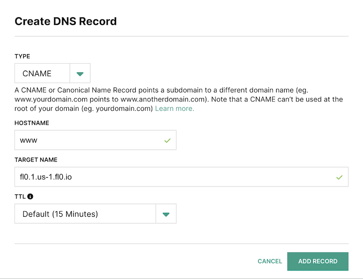

# Networking

## Custom Domains
:::tip[Pro Feature]
Upgrade to Pro to use **Custom Domains**
:::
If you already own a domain and would like to connect it to a service running on FL0. FL0 handles the provisioning of a TLS certificate automatically.



### Setting up a custom domain
To set up a custom domain, follow these steps:
1. Navigate to your application
2. Click on the Settings tab
3. Click on the Custom Domains menu item on the left-hand side
4. Type your domain into the text field and press "Save"
5. Copy the `CNAME` record that appears and add it to your DNS
6. Wait for your domain to be verified by FL0

Due to the nature of DNS, changes may take up to 72 hours to take effect.

### Adding a DNS record
To add the `CNAME` record to your DNS, copy the value provided by FL0. It might look like `fl0.1.us-1.fl0.io`.
Log in to your DNS provider's control panel and create a new `CNAME` record.

**Hostname**  
Your subdomain, without the rest of the URL.  
E.g. `www`

**Target name**  
The value provided by FL0.  
E.g. `fl0.1.us-1.fl0.io`

**TTL**  
Leave as default




### Limitations
FL0 currently supports subdomains only. This means you can use `www.mydomain.com` or `api.mydomain.com` but not `mydomain.com`.

## Outgoing IP Addresses
If you need FL0 to connect to external services, you might need to know the IP addresses that FL0 uses so you can allowlist them in your firewall settings.
Common examples of this include:

1. Connecting to a database hosted outside of FL0
2. Connecting to an SFTP
3. Connecting to a third party REST API

FL0's outgoing IP addresses are broken up by region, you can either allow all of these, or only the ones for the region you have deployed to:

### AU-1 - Australia
```
3.105.50.240
52.62.78.249
52.65.239.223
```

### IE-1 - Ireland
```
52.208.91.145
54.220.162.246
54.78.155.63
```

### SG-1 - Singapore
```
13.215.133.178
52.74.76.241
52.74.232.11
```

### US-1 - United States
```
18.233.252.97
3.222.193.16
18.215.57.10
52.2.134.189
34.199.193.38
52.87.146.249
```

Please add these IPs to your firewall allowlist.
