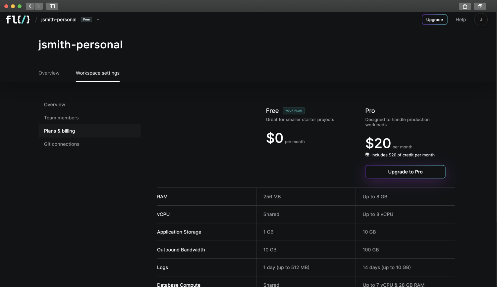

# Pricing & Plans

Please see our [pricing page](https://www.fl0.com/pricing) for information on pricing specifics and plan inclusions.

## Managing Billing

Billing is managed at the [Workspace](./workspaces) level, and can be found by navigating to the **Workspace settings** page and clicking on the **Plans & billing** tab.

### Upgrading a Workspace

To upgrade your free workspace to a paid plan, click the "Upgrade to Pro" button on the [Plans & billing](#managing-billing) page and follow the checkout instructions.

### Downgrading a Workspace

1. Click the "View my plan" button on the [Plans & billing](#managing-billing) page.
2. On the page that opens, click "Cancel plan".

After downgrading a workspace you will continue to have access to Pro features for the remainder of the month. You will continue to be charged usage costs until the plan expires at the end of the month.

### Editing Payment Information

You can change the payment method attached to your Fl0 plan with the following steps. Keep in mind you must always have a default payment method while your plan is active.

1. Click the "View my plan" button on the [Plans & billing](#managing-billing) page.
2. On the page that opens, add or delete payment methods

### Billing Cycles

A subscription’s billing date is determined by the date the subscription was created.

For example, if you upgraded to Pro on the 2nd of the month, you will always be billed on the 2nd. This date is referred to as the "anchor day".

If the upcoming month doesn’t have the anchor day, the subscription will be billed on the last day of the month. For example, a subscription starting on January 31 bills on February 28 (or February 29 in a leap year), then March 31, April 30, and so on.
