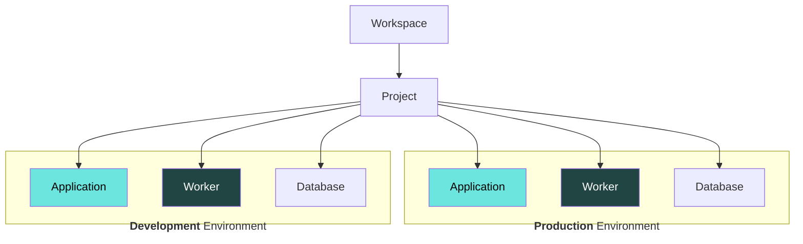

# Projects

Projects sit inside a Workspace and are a great way to separate work into logical groups. Each project has its own:

1. Team members & permissions
2. Environments
3. Applications and Databases

### Creating Projects

New projects can be created inside a workspace by following these steps:

1. Navigate to your Workspace Overview page
2. Click the **New project** button
3. Give your project a name

### Switching Projects

To see a list of all your projects, and switch between them, navigate to the Workspace Overview page by clicking the Workspace name in the breadcrumbs.

### Managing Apps and Environments

Each project comes with 2 environments by default; Development and Production. Environments are segregated from each other, meaning apps cannot communicate across environments.

Environments are displayed on the Project Overview page as columns. Each box inside an environment represents an app or database.

### Creating Environments

Currently FL0 supports 2 environments by default. To request additional environments please contact the FL0 team.
