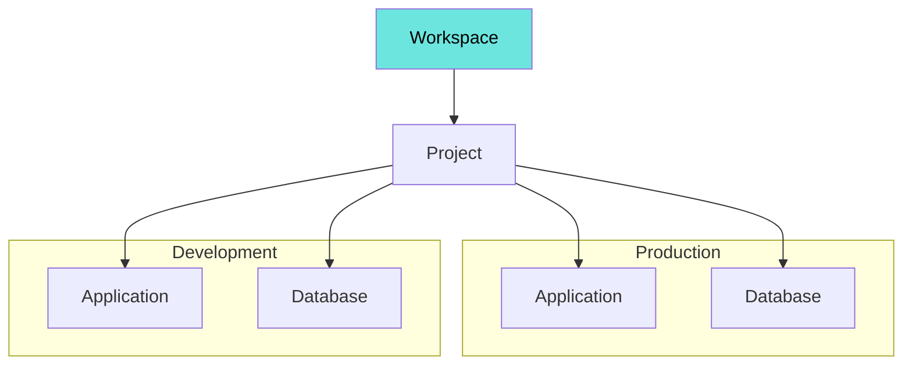
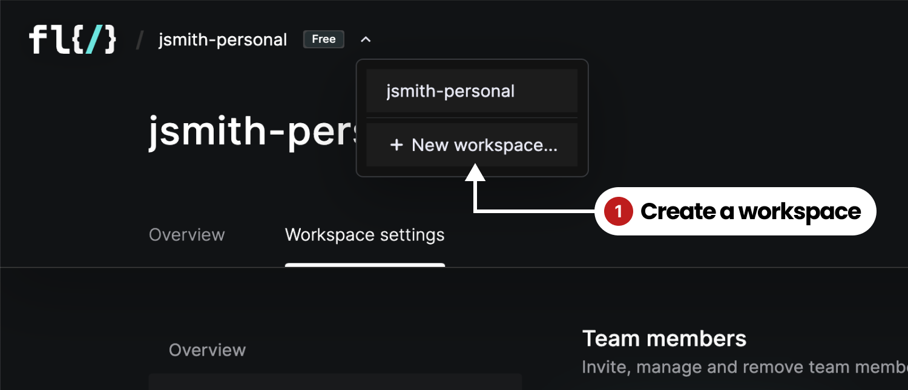

# Workspaces

Workspaces in FL0 are home to all your projects, services and databases. A workspace may represent an organization or a team. When you create a FL0 account, we give you a default Workspace to use.

Each Workspace has its own:

1. Users & permissions
2. Billing plan
3. Connection to a Github organization

## Creating Workspaces

You can create additional Workspaces in FL0 by following these steps:

1. Click the arrow next to Workspace breadcrumb in the top-left corner of the interface
2. In the dropdown menu, click **New workspace**
3. Give the Workspace a name

:::tip
You can only belong to a single Free Workspace at a time. To add more Workspaces, you need to upgrade your existing Free workspace first.
:::

## Switching Workspaces

To switch between Workspaces, click the arrow next to the Workspace breadcrumb in the top-left corner of the interface and select a different Workspace.

## Managing a Team

You can invite users to your workspace and control their permissions:

1. Navigate to the **Workspace settings** tab
2. Select the **Team members** link on the left
3. Click the **Invite team member** button or select an existing user to edit their permissions

### Editing User Permissions

From the [Team members](#managing-a-team) section, select a user to view their details. From there:

1. Give them admin permissions, or
2. Grant permissions to specific projects within the workspace

### Revoking an Invitation

Once an invitation is sent it's not possible to revoke it, however invitations expire in 24 hours. If the user accepts the invitation, they will appear in the list and can be removed from the workspace.

### Revoking User Access

From the [Team members](#managing-a-team) section, select a user to view their details. From there, click the **Remove user** button.

## Managing Billing

Billing is managed at the Workspace level, and can be found by navigating to the **Workspace settings** page and clicking on the **Plans & billing** tab.

To read more about upgrading, downgrading and managing payment methods, see the [pricing and plans](./pricing-plans) page.

## Connecting a Workspace to Github

When deploying a new app, FL0 will retrieve a list of repositories from Github and ask you which one to use. In order to do that, FL0 needs your permission to integrate with Github. Each workspace can be connected to one or more Github organizations.

1. Navigate to the **Workspace settings** tab
2. Select the **Git connections** link on the left
3. Click the **Open Github connection page** button
4. In the popup, install the FL0 Connector into the appropriate Github organization

:::info note
Your FL0 workspace can be connected to multiple Github orgs, but a Github org can only be connected to a single FL0 workspace.  
:::

## Leaving a Workspace

If you no longer wish to be part of a Workspace you can remove yourself by navigating to the [Team members](#managing-a-team) section and clicking the **Leave workspace** button.

## Renaming a Workspace

:::info note
The ability to rename a workspace will be coming soon!
:::

## Deleting a Workspace

:::danger
**Careful!** Deleting a workspace is permanent, and will delete all your apps and databases, including your Development and Production environments!
:::

1. Navigate to the **Workspace settings** tab
2. Select the **Overview** link on the left
3. Click the **Delete workspace** button in the **Danger zone** section
